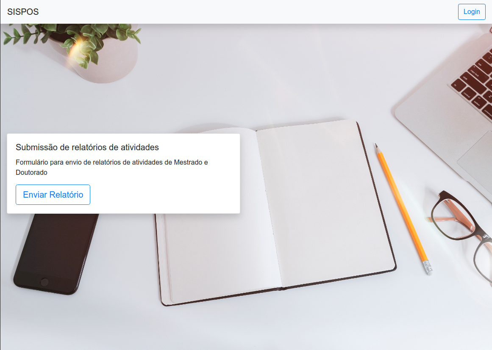

# Pos - Relatorios


[](https://travis-ci.org/iagsti/pos-relatorios)

Este sistema tem como objetivo automatizar a avaliação dos relatórios de atividades de Pós-Graduação.

## Como começar
Estas instruções auxiliarão na instalação do sistema do sistema com a finalidade de testar e desenvover.

### Pré-requisitos
 - python 3
 - token de acesso ao oauth usp

### Instalação
1. No diretório raíz da aplicação crie o arquivo .env.
```
cp contrib/env-example ./.env
```
2. Preencha as variáveis de ambiente dentro do arquivo .env
3. Instale as dependências.
```
pip install
```
4. Faça a migração das tabelas do banco de dados.
```
python manage.py migrate
```
## Iniciando a aplicação
Para iniciar a aplicação com o servidor built in execute o comando:
```
python manage.py runserver
```
## Rodando os testes
Para rodar os testes execute o comando:
```
python manage.py test
```
